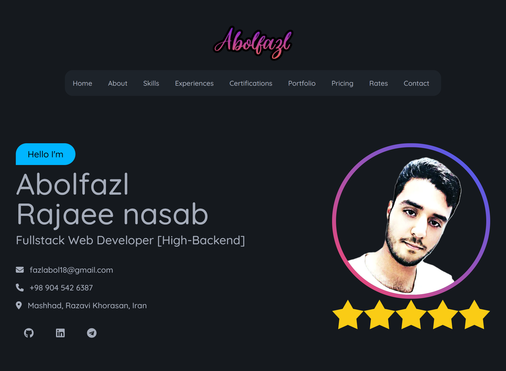

# My React Resume 💼

Welcome to my personal resume project built with React! 🎨✨ This project showcases my skills, experiences, and portfolio in a beautifully designed, user-friendly interface.

## 📚 Table of Contents

-[💡 Introduction](#-introduction)

-[🌟 Features](#-features)

-[📁 Project Structure](#-project-structure)

-[🔧 Technologies Used](#-technologies-used)

-[⚙️ Installation](#-installation)

-[🚀 Usage](#-usage)

-[📝 License](#-license)

-[📞 Contact](#-contact)

## 💡 Introduction

This project is a digital version of my resume, designed with a focus on aesthetics and user experience. It features smooth animations, responsive design, and a clean layout to present my professional background effectively.

## 🌟 Features

- **Home Section**: A welcoming hero section with a catchy banner. 🏠
- **About Section**: A brief introduction about myself. 🧑‍💼
- **Skills Section**: Highlights of my technical skills. 🛠️
- **Experience Section**: Detailed overview of my work experiences. 💼
- **Certifications Section**: Showcase of my certifications. 📜
- **Portfolio Section**: Display of my projects and achievements. 💡
- **Pricing Section**: Information about my services and pricing. 💰
- **Reviews Section**: Feedback and testimonials. 🌟
- **Contact Section**: Easy way to get in touch with me. 📬

## 📁 Project Structure

Here\'s an overview of the project structure:

```plaintext
src/
├── assets/
│   ├── certifications/
│   ├── portfolios/
├── components/
│   ├── Certifications.jsx
│   ├── Contact.jsx
│   ├── Experiences.jsx
│   ├── Hero.jsx
│   ├── Information.jsx
│   ├── Navigation.jsx
│   ├── Portfolios.jsx
│   ├── Pricing.jsx
│   ├── Reviews.jsx
│   ├── Services.jsx
│   ├── Skills.css
│   ├── Skills.jsx
├── parts/
│   ├── Footer.jsx
│   ├── Header.jsx
│   ├── Main.jsx
```

## 🔧 Technologies Used


## ⚙️ Installation

To get started with this project, clone the repository and install the dependencies:

```bash
git clone https://github.com/abolraj/me-react
cd me-react
npm install
```

## 🚀 Usage

To run the project locally, use the following command:

```bash
npm run dev
```

This will start the Vite development server, and you can view the resume at `http://localhost:5173`.

## 📝 License

This project is licensed under the [MIT License](./LICENSE).

## 📞 Contact

Feel free to reach out if you have any questions or want to connect!

- **Email**: fazlabol18@gmail.com 📧
- **LinkedIn**:[Your LinkedIn Profile](<https://www.linkedin.com/in/your-profile/>) 🌐
- **GitHub**:[Your GitHub Profile](https://github.com/abolraj) 👨‍💻
